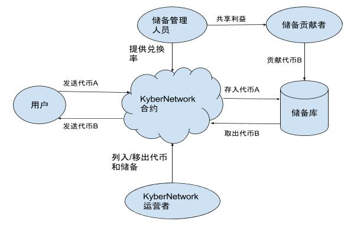

# 6.3 去中心化交易所Kyber Network

恭喜你，它早期的白皮书（v 0.8）已经无从下载了。新版白皮书已经面目全非。

以下是摘录的部分内容：

**1、KyberNetwork 的参与者**

网络中的参与者共分为 5 种角色：

1. 在网络中发送和接收代币的用户。KyberNetwork的用户包括个人用户、智能合约账户和商家。
2. 为平台提供流动性的（一个或多个）储备实体。它可以是平台自己的储备库或者由其他者注册的造市第三方储备库。根据是否从公众那里取得贡献，储备库也被分为公共的和私有的两类。
3. 为储备实体提供资金并分享平台的利润贡献者。这类参与者只存在于公共储备库中，从公众那里接收贡献来创建储备库。
4. 维护储备库、决定兑换率并将该比率反馈给 KyberNetwork 的储备管理者。
5. KyberNetwork 运营者，负责在网络中添加、删除储备实体以及将代币对列入/移出交易列表。Kyber 团队将作为初始运营者引导平台的早期发展。后期将设置去中心化的管理来接替团队的运营者角色。

每一位参与者都以不同的方式独立地与智能合约交互。用户在单个交易中同时发送和接收代币，而无需等待来自储备实体或 KyberNetwork 运营者的任何响应。KyberNetwork 运营者负责添加和删除储备，而储备管理者每经过一个固定的周期（一般而言是几秒钟）决定新的兑换率并将该比率提供给合约。主合约依靠储备实体来保证高流动性。

图表 4.每一个活动者间的交互过程

**2、动态储备库**

KyberNetwork 通过使用网络中现有的储备来保证高流动性。不同的储备由不同的储备管理者直接管理，这一些系列行为不一定与 KyberNetwork 的运营者有关。 KyberNetwork 允许多个储备共存（通过消除储备垄断）以获得更优的价格，（通过利用其他来源）保证更佳的流动性。此外，除了 KyberNetwork 的运营者外，该网络也允许不同的人或者机构来管理自己的储备。这样的话，KyberNetwork 就可以通过将某些低交易量的代币的管理工作转移到相应的储备管理人员身上，来实现对这些代币的支持。通过这种方式，愿意承担低交易量代币交易/兑换风险的各方都可以为自己创建这些代币的储备，并在 KyberNetwork 注册。需要注意的是，KyberNetwork 不持有任何在其上注册的储备资金。他们的资金存储在他们的储备合约中，这些合约将遵循 KyberNetwork 的基本原则。

当交易/兑换请求到达时，KyberNetwork 将从所有可处理该请求的储备中获取兑换率。然后 KyberNetwork 会选择最佳的比率并执行该请求。我们保证储备和用户都是安全的，也就是说，我们不保留任何一方的资金，并且所有的交易都是原子的。

我们注意到，在我们刚开始推出 KyberNetwork 时，它可能只有我们在网络中提供的单一储备。在其它更多的储备在网络中注册之前，该储备将成为系统流动性的主要来源。

**为什么其他储备金要加入 KyberNetwork？** KyberNetwork 为储备管理者创建了一个平台，他们可以利用自身的闲置资产在平台中获利。通过为用户的交易请求提供服务，储备实体从利差中获利，而这个利差是由他们自己决定的。当然，储备实体可以随时进行交易，而不必加入KyberNetwork。但是由于 KyberNetwork 的网络效应，他们将会获得更高的收益。此外，我们还会与钱包提供商以及其它代币项目进行合作，为 KyberNetwork 带来更多的用户。

此外，KyberNetwork 还提供储备信息面板软件，帮助储备管理者管理其储备投资组合。储备信息面板将包含标准的和流行的交易算法/策略，以便储备管理者自动定价并重新调整其投资组合。我们的储备信息面板具有足够的灵活性，储备管理者可以随时随地实施和部署各自的策略。

**如何保障储备安全？**储备的安全性成为 KyberNetwork 关注的重点，特别是对于由网络中其他成员作出贡献所形成的公共储备。一个最主要的担忧是，恶意的/不道德的储备管理者可能会报出一个极为糟糕的价格并根据该价格进行交易，从而把储备中的代币耗尽。

我们将储备分为两类：（1）不接受他人贡献的私人储备，和（2）接受外部贡献并与贡献者分享利润的公共储备。尽管上述担忧依旧有效，但如果私人储备的储备管理者遵循良好的安全实践，私人储备的风险敞口可以限制在可接受的范围内。尤其是，私人储备是在本地进行处理的，其它各方不能在没有得到许可的情况下进行干预。另一方面，公共储备会因其公开特性面临更大的风险敞口。为了减轻公共储备的安全风险，我们将采用无须信任的基金管理模式，比如MelonFund（该基金由 MelonPort 开发）。这样的话，储备的贡献者无须信任储备管理者。最重要的是，我们还计划引入限制来保护开放储备。例如，储备资金只能转移到合约中预先定义的地址，例如储备合约本身以及储备与之交互的其它交易所。通过这种方式，未经授权从系统中提取资金的风险就被消除了。当然，为了避免储备管理者故意设定虚假和不合理的兑换率——例如当一个以太币只可以兑换 500 个 Golem 网络代币（GNT）时，管理者想要通过更加便宜的价格来购买到更多的 GNT，于是他设定一个以太币可兑换一百万个 GNT——我们采用链上机制（例如，防止在没有特别授权的情况下，出现不合理的价格变更）和链下机制相结合的方式来进行干预。例如，我们可以采用后台监视器的方式来监控并标记网络中储备管理者的可疑行为。当后台监视器检测到破坏网络健全度的可疑活动时，有权停止当前交易。

潜在的问题：

* 报价受制于人的主观决策, KyberNetwork 提供的报价的安全性有待市场的检验。
* 缺乏通证流动性保障机制，供需不规则，代币间的兑换率通常波动比较大。一旦缺乏愿意把代币存入储备库的人，那么这个问题将会进一步恶化。KyberNetwork计划以期货和期权形式引入衍生工具来解决这一挑战。但我们看不到其有效性。
* KyberNetwork和以下所有基于以太坊智能合约的交易，都会受到以太坊目前TPS太低的限制，即每天能承载的交易次数太少。
* 每笔交易不得超过3000美元，每人每日交易上限为15000美元。要想突破此限制，你必须先成为Advanced User Prescribed Limit，那就意味着你必须要做身份认证，以及满足其它一切所必需的条件——此规定有bug。
* 未提供去中心化的价格发现机制。

很有意思的是，经过不到一年的实践，KyberNetwork彻底抛弃了user-to-user的撮合机制！具体的改进你可以去看它的新版白皮书。

